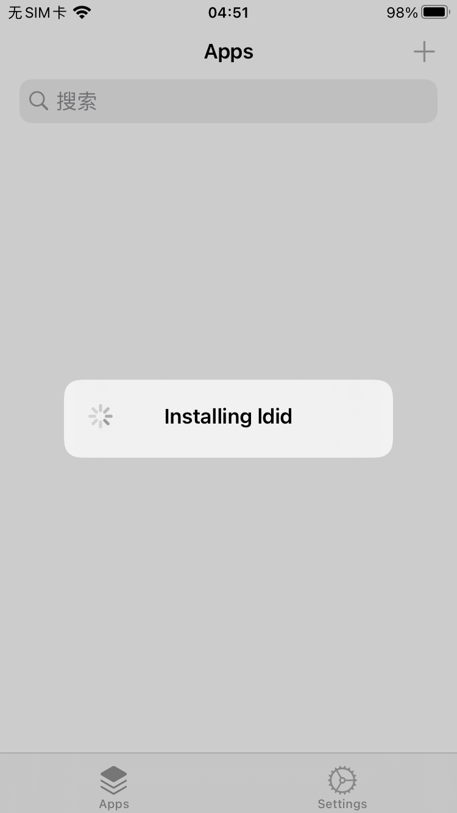
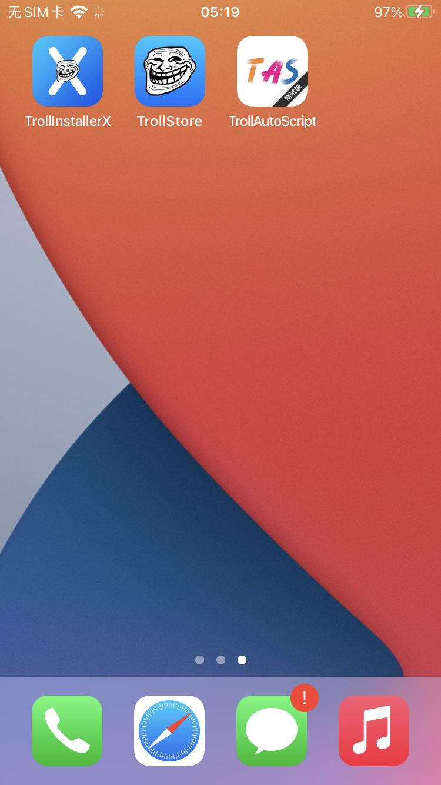
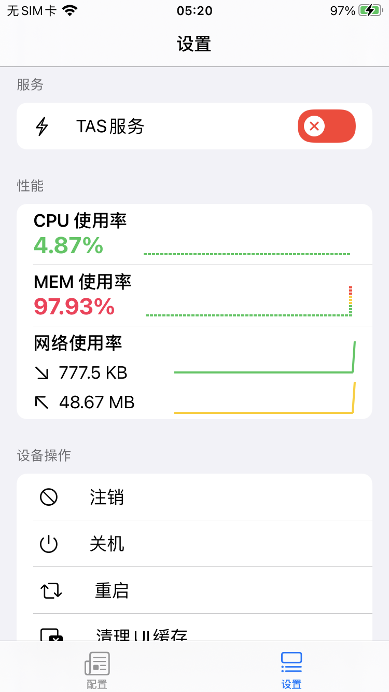

# 如何安装TrollAutoScript

如果没有安装安装TrollStore  请先安装

如已安装TrollStore    请继续

### 1.打开TrollStroe 等待 installing，如果失败，关掉TrollStroe 并换网络再试，直到成功安装

<figure><figcaption></figcaption></figure>

可能会出现弹出安装失败，这个时候点击settings ,点击install ldid可能也会安装不成功，关掉app 换个网络试试，一般多次尝试是可以成功安装的

<figure><figcaption></figcaption></figure>

 

<figure><figcaption></figcaption></figure>

### 2.输入地址安装TrollAutoScript

安装地址有两种方法:

1.群下载TrollAutoScript安装包，放在云盘然后输入地址即可

2.通过vscode安装 TrollAutoScript安装包 (推荐)

点击install from URL 输入安装地址  点击install完成安装

<figure><figcaption></figcaption></figure>

 

<figure><figcaption></figcaption></figure>

### 3.安装完毕打开软件，开启服务，如果不能开启可尝试重启或者注销

<figure><figcaption></figcaption></figure>

 

<figure><figcaption></figcaption></figure>

