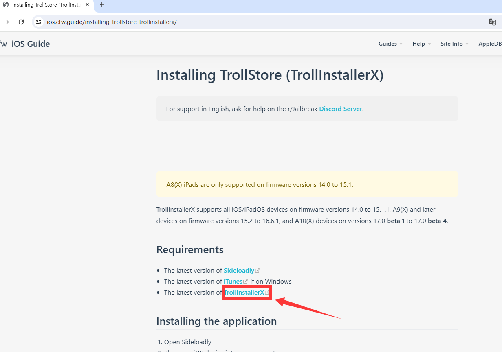
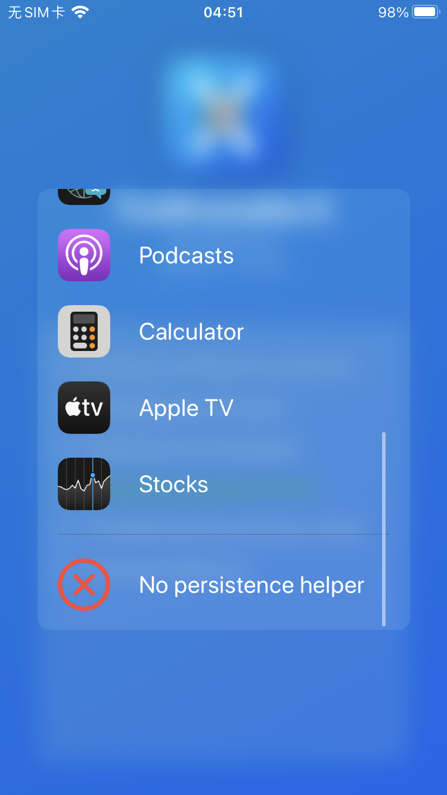
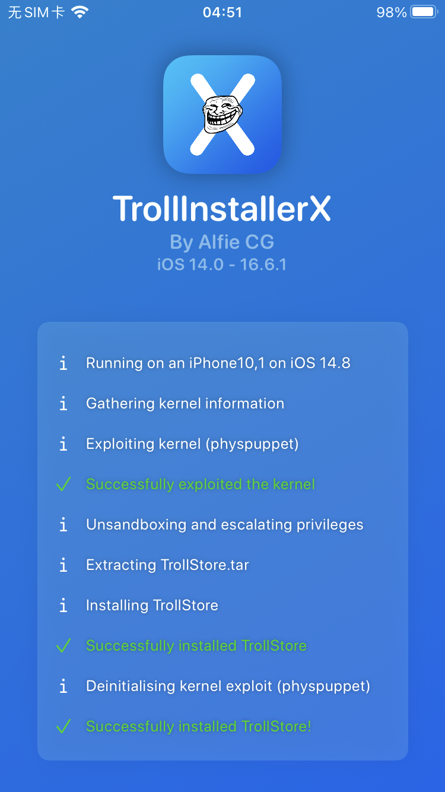

# 2.方式二 通过爱思安装

### 1.下载TrollStore   [https://ios.cfw.guide/installing-trollstore/](https://ios.cfw.guide/installing-trollstore/)

左边是系统 ，上面是手机处理器型号，找到合适自己的软件版本

如 iphone7  系统是15.8.1    iphone7处理器是A10  所以选择 15.7-15.8.3 的 TrollInstallerX

<figure><figcaption></figcaption></figure>

### 2.选择合适的版本后，

&#x20;    选择的是TrollInstallerX，打开github，下载即可

&#x20;    也可以选择其他安装方式 如 Sideloadly 和 iTunes(这里不做详细说明)

<figure><figcaption></figcaption></figure>

 

<figure><figcaption></figcaption></figure>

### 3.手机连接爱思并打开爱思--->工具箱-->IPA签名

<figure><figcaption></figcaption></figure>

### 4.导入TrollInstallerX.ipa

<figure><figcaption></figcaption></figure>

### 5.添加Apple账户

<figure><figcaption></figcaption></figure>

### 6.开始签名

<figure><figcaption></figcaption></figure>

### 7.提取文件

<figure><figcaption></figcaption></figure>

### 8.安装

<figure><figcaption></figcaption></figure>

### 9.返回桌面打开TrollStore

1.点击install TrollStore安装

2.出现选择

3.滑到最下面 点击 No&#x20;

4安装完成 。 如果出现红色英文，可以换个网络试试，或者上网搜索解决方案

<figure><figcaption></figcaption></figure>

 

<figure><figcaption></figcaption></figure>

 

<figure><figcaption></figcaption></figure>

 

<figure><figcaption></figcaption></figure>

