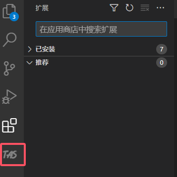
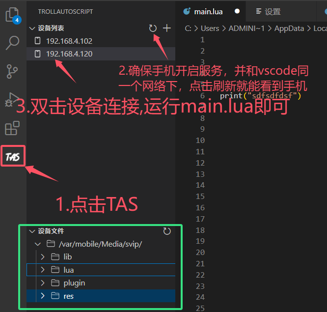
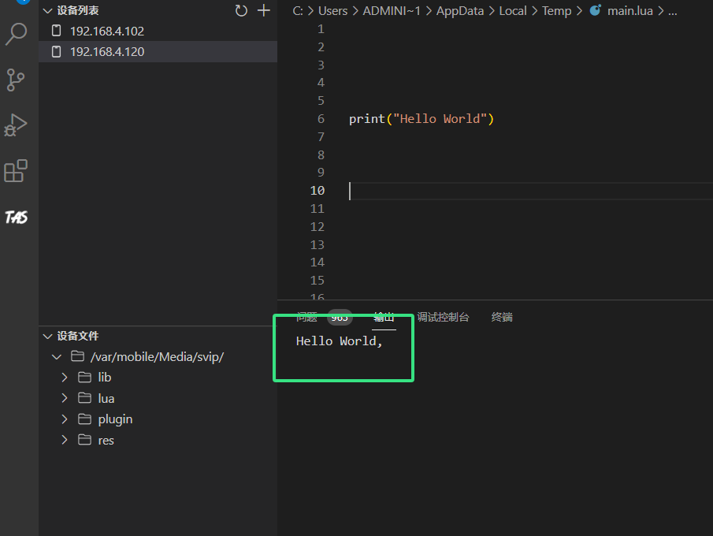

# 如何TrollAutoScript编辑代码

### 1.下载vscode



### 2.下载TrollAutoScript的vscode插件，也可以加群通过群文件下载



### 3.打开vscode   安装 TrollAutoScript的vscode插件 &#x20;

&#x20;    1.解压TAS-vscode-1.0.1.rar

&#x20;    2.里面有TAS-vscode-1.0.1.vsix  这是TrollAutoScript的code插件 &#x20;

&#x20;    3.安装到vscode里面

<figure><figcaption></figcaption></figure>

 

<figure><figcaption></figcaption></figure>

安装成功可以看到TAS标志

<figure><figcaption></figcaption></figure>

### 4. 设置  TrollAutoScript安装包路径,如果手机已经安装了，随便设置一个目录即可

<figure><figcaption></figcaption></figure>

### 5.打开调试控制台    查看->调试控制台  或使用快捷键Ctrl+Shift+Y

&#x20; 1.右上角选择TrollAutoScript 日志

&#x20; 2.下面的IP地址是你的内网IP，手机和电脑同一个网络下 ，手机打开TrollStore点击右上角install from URl    输入下面的内网ip即可下载  (手机已经安装TrollAutoScript跳过这一步)

<figure><figcaption></figcaption></figure>

### 6.连接手机并打印

<figure><figcaption></figcaption></figure>

选中main.lua  点击右上角运行

<figure><figcaption></figcaption></figure>

 

<figure><figcaption></figcaption></figure>

### 7.安装vscode中文插件 和 lua语言插件

<figure><figcaption></figcaption></figure>

 

<figure><figcaption></figcaption></figure>

### 8.疑难杂症 可以看这里


[vscode-xiang-guan-wen-ti.md](yi-nan-za-zheng/vscode-xiang-guan-wen-ti.md)


