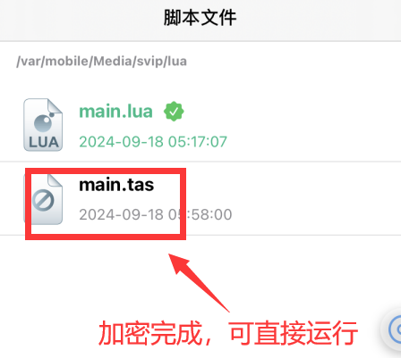

# TrollAutoScript相关问题


### 1.很抱歉，TrollAutoScript 不能使用Home键和自动启动软件功能

### 2.感觉运行起来很慢,可能使用了print，一直在尝试打印日志,在代码开头加入此代码

```lua
print = function (...) 
    return
end
```

### 3.无法运行，没有选中lua 并且运行

<figure><figcaption></figcaption></figure>


### 4.无法启动服务，多次点击TAS服务尝试，如无效，尝试注销或重启再次尝试

<figure><figcaption></figcaption></figure>


### 5.如果更新TrollAutoScript，可能无法运行代码，删除svip文件夹，关闭TrollAutoScript重新启动

### svip文件夹路径为/var/mobile/Media，保存好代码，直接删除sip文件夹即可


### 6.加密(目前只支持单个文件加密，如需加密，请把所有文件都加密)


<figure><figcaption></figcaption></figure>

<figure><figcaption></figcaption></figure>


<figure><figcaption></figcaption></figure>
