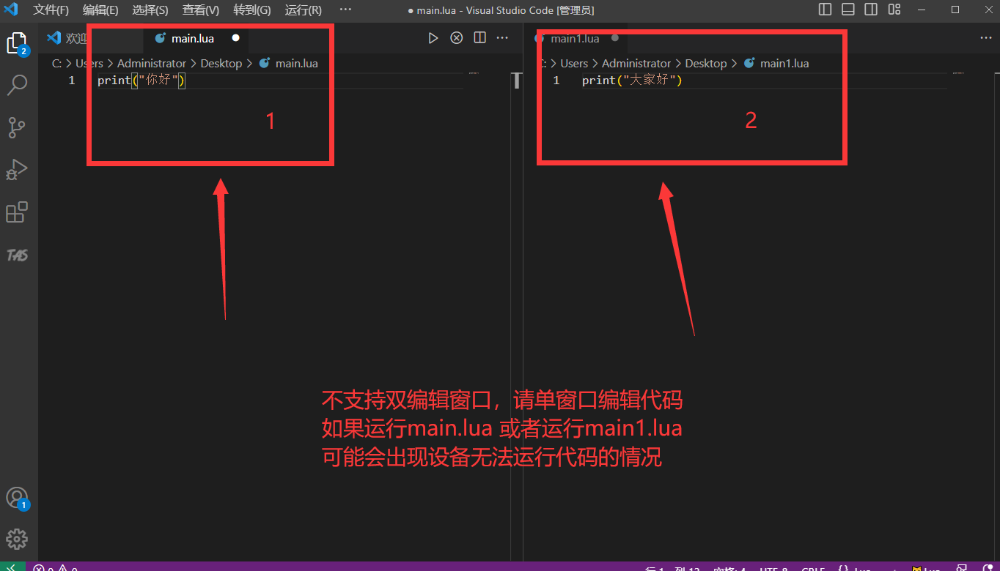
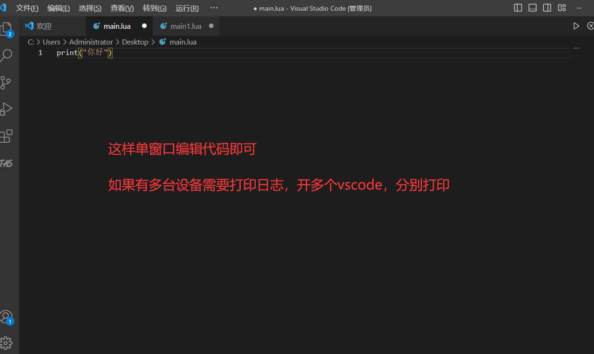
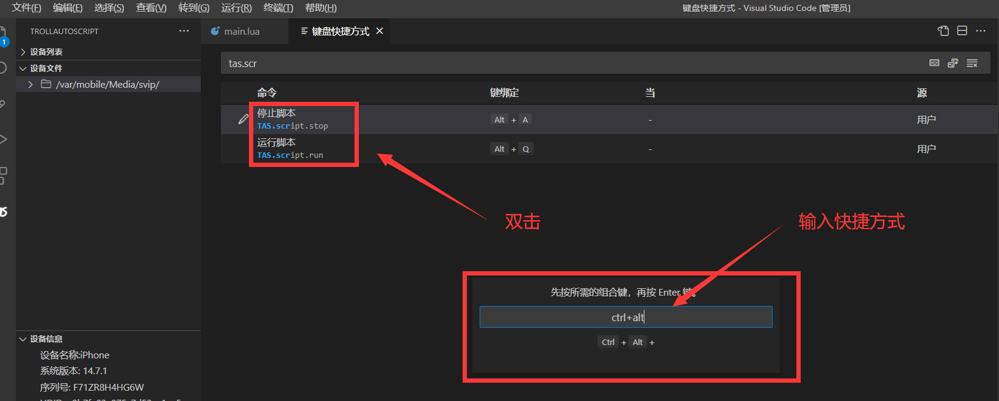

# vscode相关问题

### 1.可能是开启了双编辑界面，导致无法运行  如

<figure><figcaption></figcaption></figure>

 

<figure><figcaption></figcaption></figure>

### 2.如果多台设备要看log(日志),请打开多个vscode，分别运行代码

###

### 3.vscode快捷键问题

vscode->左上角文件->首选项->键盘快捷方式 ->搜索tas.script

<figure><figcaption></figcaption></figure>

### 4.可能会出现vscode已连接手机，运行代码，但无法打印，这个时候重启vscode，看看TAS插件还在不在，不在的话重新安装

