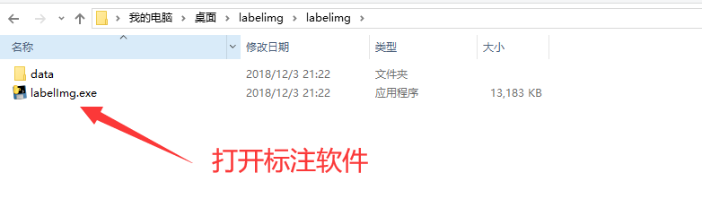
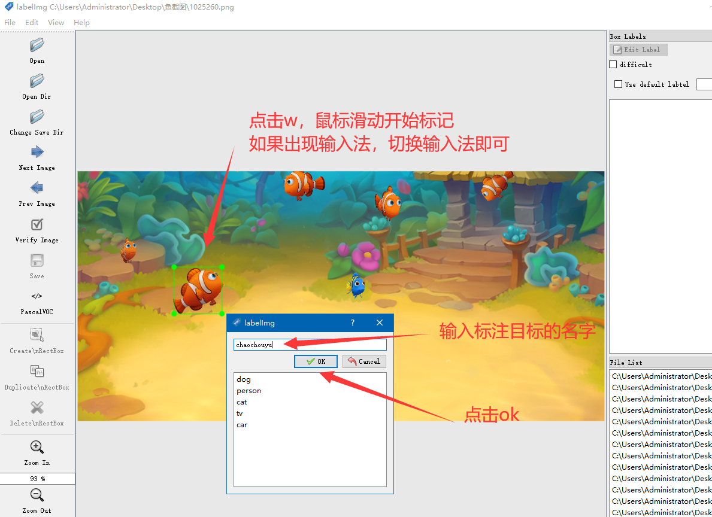
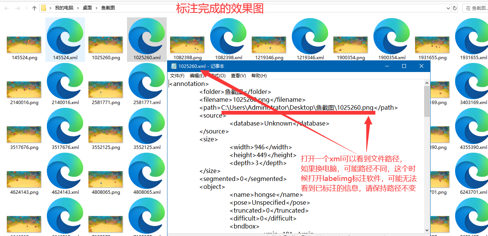

# 2.如何使用labelimg

1.下载完毕后打开软件即可

<figure><figcaption></figcaption></figure>

2. &#x20;第1步，刚才新建文件夹(里面有爱思拖出来的图片)

<figure><figcaption></figcaption></figure>

<figure><figcaption></figcaption></figure>

<figure><figcaption></figcaption></figure>

3.全部标注完成，可以看到文件夹内每张图片都会有对应的xml文件，确保每张图片都有xml，不然下一步训练会出错

<figure><figcaption></figcaption></figure>
