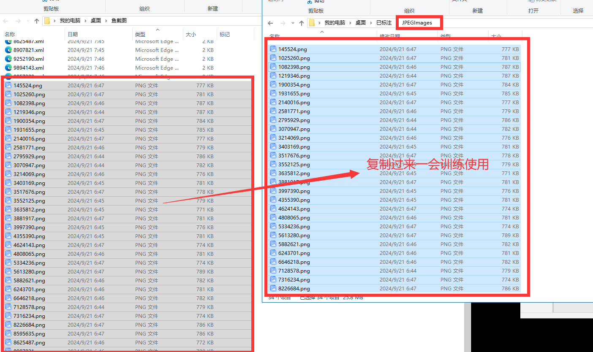

# 3.整理数据集

### 1.在桌面新建一个文件夹 如 已标注(文件夹)  并在这个文件夹内新建两个文件夹，名字分别为Annotations(放xml)   JPEGImages(放图片)

<figure><figcaption></figcaption></figure>

<figure><figcaption></figcaption></figure>

 

<figure><figcaption></figcaption></figure>

