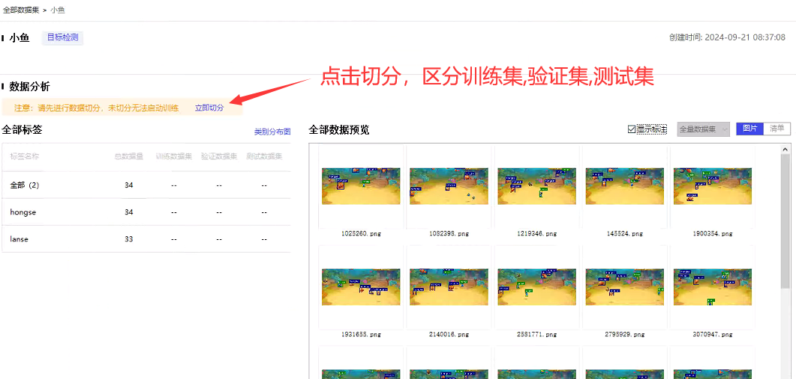

# 4.导入数据集

### 1.打开paddleX

<figure><figcaption></figcaption></figure>

### 2.导入数据集

<figure><figcaption></figcaption></figure>

<figure><figcaption></figcaption></figure>

<figure><figcaption></figcaption></figure>

### 3.点击切分

<figure><figcaption></figcaption></figure>

<figure><figcaption></figcaption></figure>

### 4.切分完成，下一步

<figure><figcaption></figcaption></figure>
