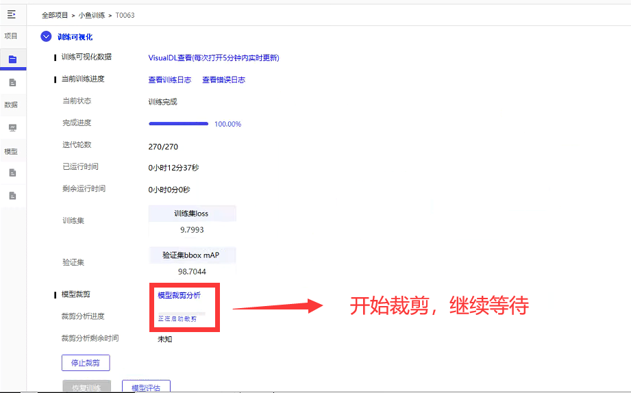

# 5.开始训练

### 1.新建训练任务

<figure><figcaption></figcaption></figure>

<figure><figcaption></figcaption></figure>

### 2.选择刚才创建的数据集

<figure><figcaption></figcaption></figure>

### 3.根据自己的实际情况选择参数，不会的情况下选择默认，GPU建议选择否

<figure><figcaption></figcaption></figure>

### 4.开始等待训练

<figure><figcaption></figcaption></figure>

### 5.因为手机内存肯定不如电脑强，所以继续缩小模型(裁剪)

<figure><figcaption></figcaption></figure>

<figure><figcaption></figcaption></figure>

<figure><figcaption></figcaption></figure>

### 6.裁剪分析后，点击立刻裁剪 (还需要等待  不要关闭软件 训练需要时间)

<figure><figcaption></figcaption></figure>

<figure><figcaption></figcaption></figure>

确定裁剪训练 还需等待 然后进入下一步

### 7.裁剪完成，并导出模型

<figure><figcaption></figcaption></figure>

不知道怎么选，可以不选

<figure><figcaption></figcaption></figure>

<figure><figcaption></figcaption></figure>

### 8.模型被导出  这个文件夹名字一会需要使用

<figure><figcaption></figcaption></figure>

