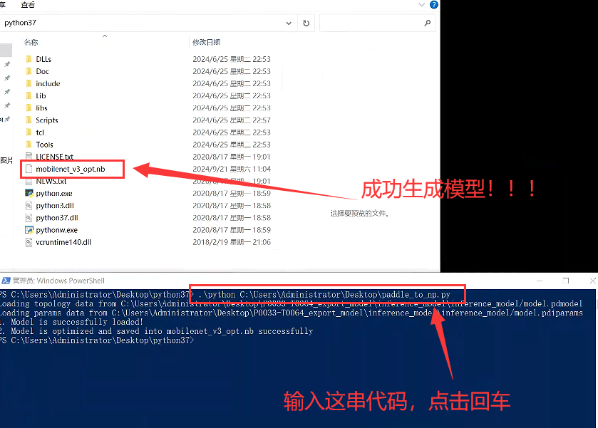

# 6.模型转换成手机模型


### 1.打开python37的文件夹  &#x20;

### paddle\_to\_np.py这个文件放在桌面就可以了


<figure><figcaption></figcaption></figure>


### 2.打开powershell窗口

<figure><figcaption></figcaption></figure>


### 3.输入命令生成手机模型

```python
.\python C:\Users\Administrator\Desktop\paddle_to_np.py
```

<figure><figcaption></figcaption></figure>


### 4.新建一个txt，里面是标注的顺序

<figure><figcaption></figcaption></figure>


### 5.训练完成，可以放在手机内了，上图左下角的两个文件

mobilenet\_v3\_opt.nb  从python37文件夹内拿出来的

label.txt  自己新建的


