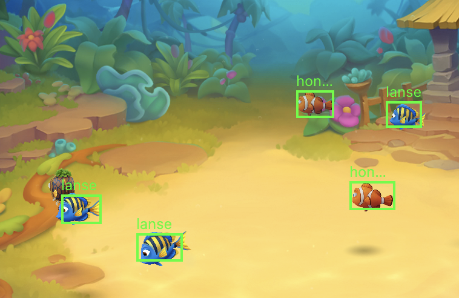

# 7.模型放入手机，并预测


### 1.拖入手机，放在哪里都可以

<figure><figcaption></figcaption></figure>

### 2.运行代码 这个时候就可以看到效果了

```lua
screen.init(1)

print("开始")
--简单的示例
--创建yolo 对象 在生产环境中 该操作会占用大量时间  通常使用全局变量 实例化一次就好
yoloObj = paddleYolo.init("/var/mobile/Media/yolo/label.txt" ,"/var/mobile/Media/yolo/mobilenet_v3_opt.nb")
for i=1,1000 do
	x,y=225,148
	yoloObj:forecast(screen.image(x,y,x+947,y+450))  -- 使用模型预测
	yoloObj:setThresh(0.3)  --如果识别不佳 可以改成0.1-0.4之间 越低识别精度越低
	result=yoloObj:result()  

	local tab = {}
	for k,v in pairs(result) do
		drawView = screenDraw.init( math.ceil( v.x+x ),math.ceil( v.y+y ),math.ceil( v.w ), math.ceil( v.h ), v.name ,0x00ff00 , 2.0 , 12, 0x00ff00)
		table.insert(tab, drawView)
		drawView:show()
	end

	sys.msleep(1000)
	drawView:hide()
end
```


### 3.效果图

<figure><figcaption></figcaption></figure>


###
