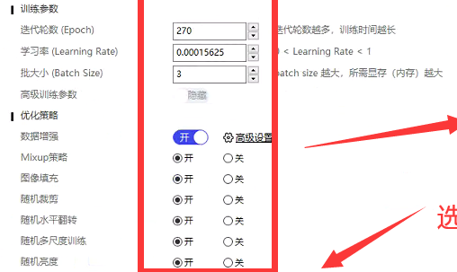

# 8.yolo训练疑难杂症


### 1.如果训练的时候发现很慢，可能是图片太多，耐性等待


### 2.关于图片限制

```lua
screen.init(1) 
x,y=225,148
--这里采用区域截图  宽947  高450的图片
screen.image(x,y,x+947,y+450):saveToPngFile("/var/mobile/Media/"..math.random(100000,9999999)..".png")

```

可以看到，截图为宽947 高为450的图片，那么也就是说，模型预测的时候范围也应该是宽947 高为450

所以下图screen.image(x,y,x+947,y+450)  也是一个宽947 高450的截图

简单来说，多大xy的图片训练，模型预测的时候也是多大的xy范围，不能多不能少，否则报错，后续提供缩小放大图片的功能，可以解决这个问题

```lua
screen.init(1)

print("开始")
--简单的示例
--创建yolo 对象 在生产环境中 该操作会占用大量时间  通常使用全局变量 实例化一次就好
yoloObj = paddleYolo.init("/var/mobile/Media/yolo/label.txt" ,"/var/mobile/Media/yolo/mobilenet_v3_opt.nb")
for i=1,1000 do
	x,y=225,148
	yoloObj:forecast(screen.image(x,y,x+947,y+450))  -- 使用模型预测
	yoloObj:setThresh(0.15)
	result=yoloObj:result()  

	local tab = {}
	for k,v in pairs(result) do
		drawView = screenDraw.init( math.ceil( v.x+x ),math.ceil( v.y+y ),math.ceil( v.w ), math.ceil( v.h ), v.name ,0x00ff00 , 2.0 , 12, 0x00ff00)
		table.insert(tab, drawView)
		drawView:show()
	end

	sys.msleep(1000)
	drawView:hide()
end
```


### 3.如果感觉模型预测不准，可以考虑以下几点

1.调整设置预测阈值

```lua
yoloObj:setThresh(0.35)--越高越准,但会漏掉相似度不高的目标
```


2.标注的图片不够多，有部分图片可能刚好分配拿去做测试和验证集了，导致某一种标注训练比较少

重新切分或者准备更多的图片


3.参数问题，一般不会是这个导致的，默认参数可以用于大多数场合

<figure><figcaption></figcaption></figure>


