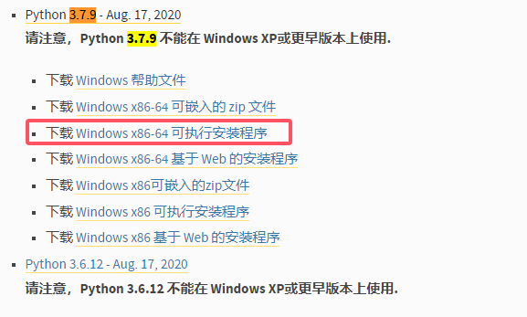
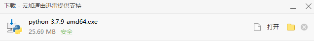

# 如何训练


### 目前只支持yolo3，不久的将来会增加更高级的


### 训练模型需要3个软件和1个文件,以下文件都放在桌面即可：

### 1.labelimg  （标注软件）

下载地址 [https://wwfp.lanzouv.com/iypq92ajwisf](https://wwfp.lanzouv.com/iypq92ajwisf)

### 2.PaddleX\_GUI\_2.1.0   (用于训练)

下载地址 [https://www.paddlepaddle.org.cn/paddlex/download](https://www.paddlepaddle.org.cn/paddlex/download)


### 3.paddle\_to\_np.py代码如下   (放在桌面就可以了)

```python
import paddlelite.lite as lite

a=lite.Opt()
# 非 combined 形式
a.set_model_dir("C:\\Users\\Administrator\\Desktop\\P0033-T0064_export_model\\inference_model\\inference_model")

# conmbined 形式，具体模型和参数名称，请根据实际修改
# a.set_model_file("D:\\YOU_MODEL_PATH\\mobilenet_v1\\__model__")
# a.set_param_file("D:\\YOU_MODEL_PATH\\mobilenet_v1\\__params__")

a.set_optimize_out("mobilenet_v3_opt")
a.set_valid_places("arm")

a.run()

```


### 4.下载python3.7  (如电脑已经安装python，可不安装)

下载地址[http://python.p2hp.com/downloads/windows/index.html](http://python.p2hp.com/downloads/windows/index.html)


#### 1.这里用python3.7.9演示，下载然后双击python-3.7.9-amd64.exe安装包

<div>

<figure><figcaption></figcaption></figure>

 

<figure><figcaption></figcaption></figure>

</div>


#### 2.安装过程

<figure><figcaption></figcaption></figure>

点击Next

<figure><figcaption></figcaption></figure>

为了方便演示，这里路径改成了 桌面的python37  然后点击install

<figure><figcaption></figcaption></figure>

安装完成，可以看到桌面多了一个pyhon37文件夹，一会用

<figure><figcaption></figcaption></figure>

